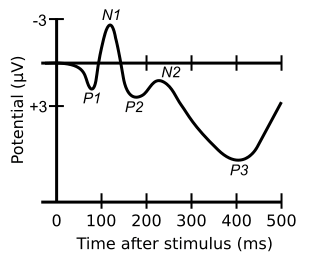

Electroencephalographic techniques measure the multichannel electrical activity which provide direct information about the brain with a high temporal resolution. The functional neuroimaging tool is important to localize cognitive activity of the brain. Electrical fields of the brain reflect the changes in neural mass activity associated with various mental processes. Temporal structure of cognitive and sensory processing is the key to understand complex neural mechanisms involved in higher order brain functions like perception of time. The interactions of the brain with the external world depend on the accurate representation of the time-dimension in neural circuits. The key aspects of the time-dimension such as the temporal binding of neural events play important roles in various cognitive processes, visual perception, learning and memory, speech production and cognitive emotions. The multiscale representation of such process from micro to meso scales ie from single neurons to a population of neurons to field potentials and macroscopic scales of EEG data were computationally analyzed and mathematically stimulated by program languages.
EEG is generated by parallel and sequential activation of different neuronal groups in the brain. The activation can be modelled by several electrical sources some of which are temporally as well as spatially overlapping. One of the main challenges of functional brain imaging is the precise localization of these electrical events in the brain based on the EEG data recorded from the scalp. The temporal resolution of an EEG data is a crucial measurement for localization of activities arising from the electrical behavior of the brain. The map of an EEG data may superimpose by other sub topographic maps which can be filtered by various filtering procedures. The temporal and spatial characteristic as an oscillation or a rhythm extends in a certain time window is the basis of assumption for the time-frequency analysis methods. Also filtering techniques like Spatio-temporal wavelet decomposition were applied as a preprocessing method that improves the topographic data which is superimposed by other EEG generators like temporal, frequency and/or spatial overlapping.

&nbsp;
**EEG based Brain computer interface :**
&nbsp;
Non-invasive electroencephalogram (EEG)-based brain-computer interfaces (BCI) is a technique used to measure brain electrical impulses and analyses different brain signals that are translated into commands. Brain-computer interface (BCI) systems provide new communication and control channels from the brain to an output device bypassing conventional motor output pathways of nerves and muscles. The BCI research aims at the development of a system that allows direct control of a computer application or a neuroprosthesis, solely by human intentions reflected by certain brain signals. Most of the Modern BCI technology is based on techniques for the classification of single-trial brain signals.
Generally, BCI is a computer-based system which translates brain signals into commands that are passed onto an external application or appliance so as to facilitate user’s intention. Thus, people can communicate with the environment, although they do not use their peripheral nervous system and muscles. Many clinical studies on BCI application were focused on individuals with motor impairment, individuals who are not able to speak and/or use their limbs to communicate and interact with others, BCI based devices helps them to operate appliances as domestic devices, computers, speech synthesizers and assistive deployments, or control neural prosthetics for walking and manipulating objects. BCI application has been explored in terms of data acquisition technique, control signals, EEG feature extraction, classification methods, and performance evaluation metrics (Fig.1).

&nbsp;

Fig 1: Flowchart for the development of EEG based BCI

&nbsp;

**EEG Control Signals Used in BCI Applications :**
&nbsp;
The neurophysiological EEG signals were decoded that allows the BCI to understand the subject's intention and these signals are known as EEG control signals. BCI aims to identify the specific neurophysiological signals of a given subject in order to associate a command to each of these signals. Some of these control signals are relatively easy to identify, as well as being relatively easy to control by the user. The extensively utilized EEG control signals for promoting communication and environmental control and rehabilitation are event-related potential (ERP) like N200, P300 ERPs, Steady State Visual Evoked Potentials (SSVEP), Sensorimotor Rhythm (SMR) and Slow Cortical Potential (SCP).

&nbsp;
&nbsp;
**Event Related Potentials (ERPs):**
&nbsp;
Event-related brain potentials (ERPs) provide high-resolution measures of the time course of neuronal activity patterns associated with perceptual and cognitive processes. It measures voltage changes in the brain related to specific visual, auditory, or other sensory stimuli, as well as cues signaling following motor preparation, motor execution, or covert mental operations (e.g., imagery). The ERP is obtained by extracting and averaging multiple temporal segments from the event related EEG data that define particular event of interest. The amplitude, latency, and topography of the resulting positive and negative deflections are taken to index the underlying mental operations. ERPs elucidate the cognitive processes in perception, attention, emotion, action, learning and memory. majority of ERP studies investigated the responses that occur in the first 100–500 ms after the stimulus of cognitive processes and the main ERP waveforms are P300 and N200 relating to mental events. The waveforms were described according to latency and amplitude of signals. ERPs are different from evoked potentials, which is mainly associated with more elementary sensory stimulation.

&nbsp;
**P3 Component or P300:** 
This event-related potential generated in the Pz areas of the brain approximately 300 ms after stimulus onset. The P3 component is a positive deflection peak that reflect attentional resource allocation and memory-updating operations which are major focus of research into event-related potentials. P3 amplitude seems to reflect stimulus information ie greater attention produces larger P3 waves. It is noted that the response's peak amplitude of P300 ERP waveform is much larger even for a less probable stimulus.  A reduced P300 amplitude is an indicator of neurobiological vulnerability that underlies disorders relating to alcohol dependence, drug dependence, nicotine dependence, conduct disorder and adult antisocial behavior (Fig.2).

**N 200/N2 Wave:** This ERP is a negative deflection peaking generated about 200 msec after presentation of stimulus. There are 3 components of the N200 waveform(Fig.2).

a)	*N2a/ Mismatch negativity (MMN)*: MMN is a negative component which is elicited by any discriminable change in a repetitive background of auditory stimulation. MMN represents the brain’s automatic process involved in encoding of the stimulus difference or change.

b)	*N2b*: It is slightly later in latency than the N2a and appears when changes in physical property of the stimulus are task relevant.

c)	*N2c*: It’s the classification N2 which elicited when a classification of disparate stimuli is needed.

&nbsp;

Fig.2 Event Related potential (ERPs) Waveform-N200 and P300

&nbsp;

**Motor Imagery EEG:**

Movement of a limb or even contracting a single muscle changes the brain activity in the cortex. Preparation for the movement or imagining movement known as motor imagery (MI) generates oscillations in the brain motor areas known as sensorimotor rhythms (SMR). Increase and decrease of oscillatory activity in a particular frequency band are referred to as event-related synchronization (ERS) and event-related desynchronization (ERD), respectively. The most influential frequency bands for motor imagery are the alpha and beta brain waves. Activity invoked by the left- and right-hand MI is generated from the C3 and C4 areas of the brain, respectively, whereas the foot movement imagery is originated from Cz. Left and right foot movements are almost impossible to distinguish in EEG due to the fact that the corresponding cortical regions are extremely close. The cortical areas must be large enough to produce detectable patterns in the background EEG. The cortical areas of the left hand, right hand, tongue, and foot, are large and distinguishable. Hence the movement of those body limbs via imagination can be controlled by BCI applications.
